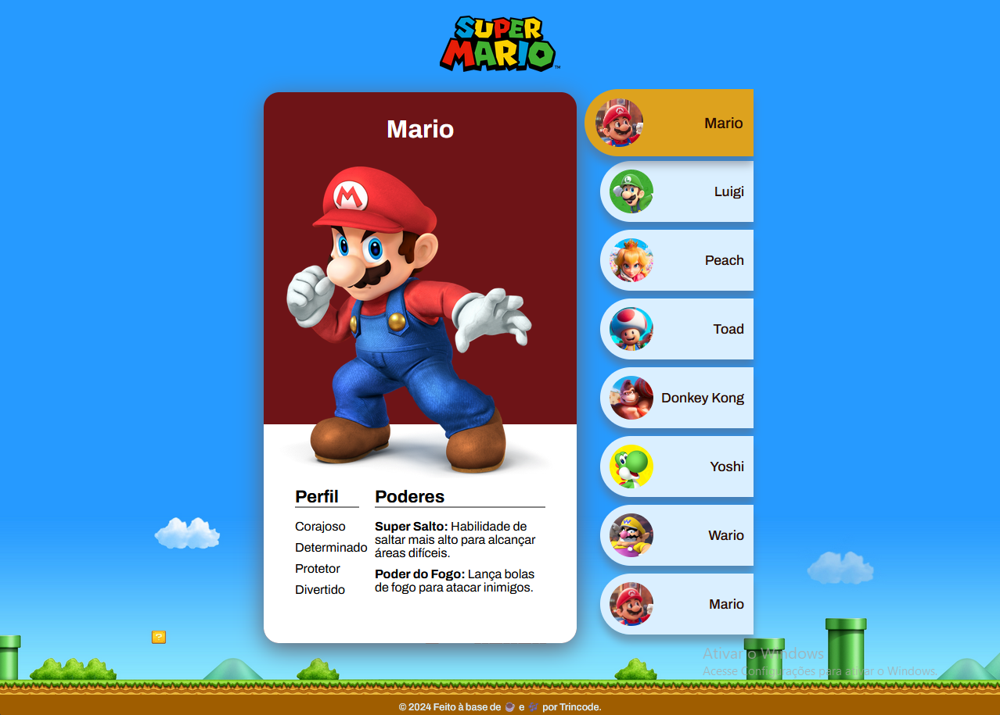
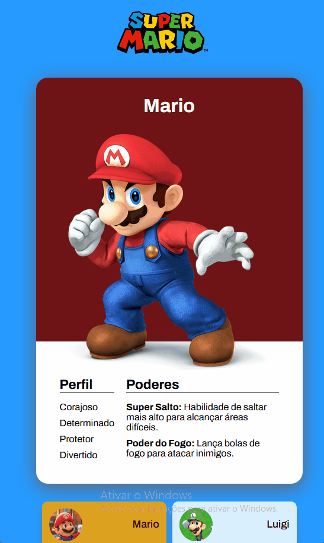

# Site – Mundo Super Mario

Dando continuidade aos estudos de HTML e CSS, agora fiz um projeto inspirado no universo Super Mario, destacando as personalidades e habilidades icônicas dos personagens. Focado em design totalmente responsivo e interação intuitiva. Foi um belo desafio, e gostei muito do resultado final, pois os elementos visuais que busquei me remeteram bastante as memórias antigas da época de jogatina. Em breve, implementarei o JS para tornar possível a seleção dos personagens.

## Visão geral

### ⚔️ O desafio

- Construir de apresentação de personagens do Super Mario World

### 🖼️ Aparência

 

### 🖇️ Links

- Acesso ao site: [https://trincode.github.io/mundo-super-mario/](https://trincode.github.io/mundo-super-mario/)
- Repositório github: [https://github.com/trincode/mundo-super-mario](https://github.com/trincode/mundo-super-mario)

## Meu processo

### Tecnologias

- HTML
- CSS

### Desafios e Conceitos aplicados

- Responsive Design
- CSS Flexbox

### O que aprendi

Sem conceitos inéditos para mostrar.

### Desenvolvimento contínuo

Pretendo adicionar a possibilidade de seleção dos outros personagens com JS.

### Recursos úteis

- [Biblioteca de fontes - Google](https://fonts.google.com/) - Usei a fonte Archivo nesse projeto;

## Autor

- LinkedIn - [Clayton Trindade](https://www.linkedin.com/in/clayton-trindade-93b925329/)

- Instagram - [@trincode - Clayton Trindade](https://www.instagram.com/trincode/)

## Agradecimentos

Meus agradecimentos aos [@roberto-hofstetter](https://github.com/roberto-hofstetter) e [@cadudias](https://github.com/cadudias), criadores do DevQuest, curso no qual aprendi a maioria dos conhecimentos utilizados aqui nesse projeto!

